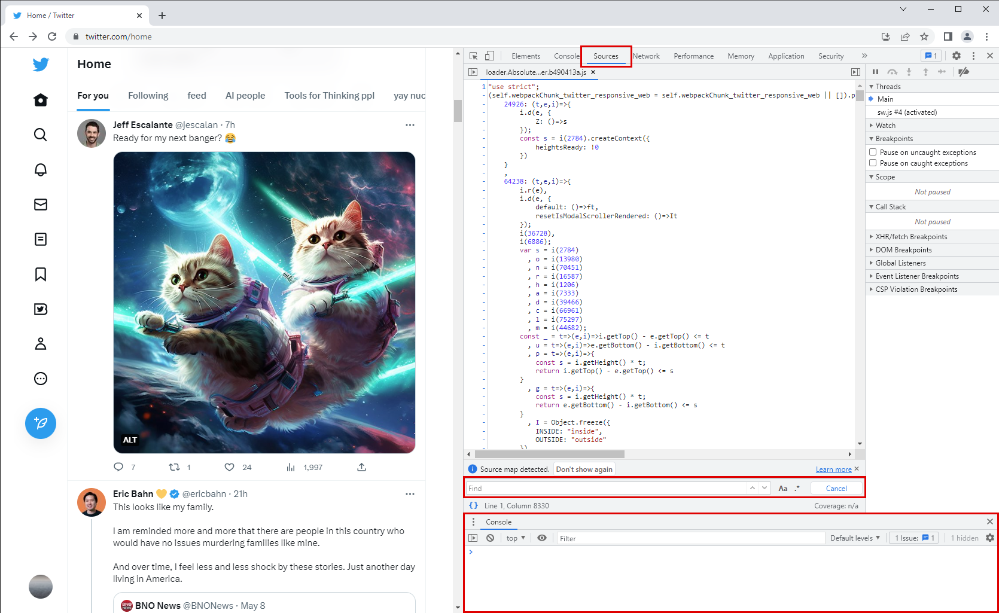
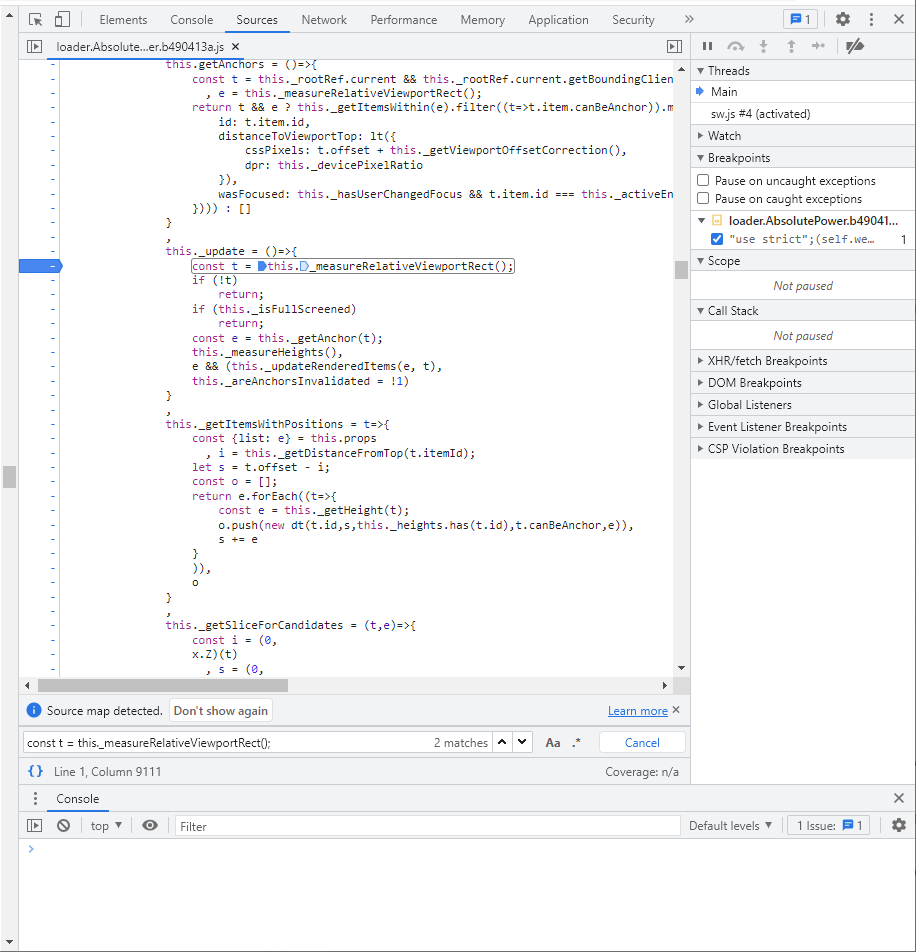

This quide is intended for people who are worried that Twitter can go away, or that it will start purging inactive account of people who are no longer with us. 

**If you are looking to preserve a memorial account, and struggling to preserve it with instructions below, please feel free to open a [preservation request](https://github.com/jurijsk/take-home-twitter/issues/new?template=preservation-request.md).** I can not give any quaranties, but I will try to help, or someone else can pick up the ticket.

This guide describes how to preserve tweets, replies or bookmarks from Twitter as standalone page that works without connection to the internet.

Unfortunately, videos are not going to be saved.

If you are not familiar with browser DevTools, this can be intimidating, but I will try to lead you through. If it is not working, show this to your favorite computer person. **If you know your way around `DevTools` instructions for you are in bold**.


## 1. Open Twitter profile on the tab you want to preserve. 

* To save tweets, go to `twitter.com/USER_NAME` e.g. https://twitter.com/jurijsks
* To save tweets and replies, go to twitter.com/USER_NAME/with_replies
* For bookmarks (you can only do that for your account), go to https://twitter.com/i/bookmarks
* it works on the home page as well if you want to take some toxicity with you on the long flight.

*You have to be logged in with your Twitter account from your PC or laptop.*


### 1.1 `DevTools` 101

To open DevTools in most browsers, use `F12` or `Crtl+Shift+i`. If it does not work, [see this](https://appuals.com/open-browser-console/), or google or bing "how to open BROWSERNAME on Mac [or PC]".

In DevTools open `Sources` tab, press Ctrl+\` (it's a button below `Escape`) to open the Console tab where you will copy code snippets to execute on the later steps.


The result should look something line this:


Before going further, make sure that the page is open at appropriate width to display tweets properly and to have enough room so see what is going on with in the DevTools. In the screenshot above, I've sized the page to display tweets but not the sidebars, we do not need them.


## 2. Scroll down to load all the tweets. 
Use `Page Down` key on your keyboard to speed up the process. You have to do that because Twitter loads 40 tweets at the time, and once loaded it keeps them to display them when you scroll up and down. 

**Or copy the block of code below to the console and wait for it to say done**
```
//scroll to the bottom while scrolls
function scroll(console){
    let scrollEl = document.scrollingElement; 
    
    if(scrollEl.scrollTop + scrollEl.clientHeight == scrollEl.scrollHeight){
        clearInterval(interalId);
        return "Done, but scroll down to double check, and launch set the inteval again in needed";
    }else {
        scrollEl.scrollBy(0, 42000);
        return "scrolling";
    }
}
let interalId = setInterval(() =>  console.log(scroll()), 3000);
```

Now to the scary part.

## 3. Get infinite display

We need to convince Twitter that we have an infinitely large screen and that it is wise for them to display all tweets at once.

* To do just that, **press `Crtl+P` to open a file that name starts with `loader.AbsolutePower`** quite ironically.

* When the file is open, press `Ctrl+F` to search within the file. *(it should be the search box in the code panel, not the regular in-page search)*

* **Search for `const t = this._measureRelativeViewportRect();`**

There will be 2 matches, **you are interested in the first match, one preceded with `this._update = ()=>{`**



* Click on the margin of the file to **set a `breakpoint` on the found line of code**. It will look like blue arror pointing to the line of code you just found. Should look something like the screenshot below.

* **Now you need to trigger the breakpoint to do the magic. To do that, scroll the page a bit up.** You will see the line of code is highlighted in blue. That's a good sign.

* **copy the following block to the Console at the bottom of `DevTools` and press `Enter` to execute it.**

```
this._measureRelativeViewportRect = function() {
    let doomScrollScreenSize = document.scrollingElement.scrollHeight;
    return {
        _top: 0, 
        _height: doomScrollScreenSize, 
        getTop: function() {return 0;}, 
        getBottom: function() {return doomScrollScreenSize;}, 
        getHeight: function() {return doomScrollScreenSize;}}
}
```


* **Remove the `breakpoint`** by clicking on the blue arrow, and click on the play/resume button in the top right corner of the `DevTools`, it is also blue.

Page should go brrrr. You can notice that the scrollbar started to move and likely jump somewhere, that is ok, wait for a while for it to do its thing. Do not scroll while it is happening.

## 4. Cleanup & Save

* **Copy and execute the next bit of code in the console**
```
//stop rerendering on crolling
window.addEventListener("scroll", function(event) {
    event.stopImmediatePropagation();
}, true);

//remove script to stop the page talking to the base after it is saved.
document.querySelectorAll('script').forEach((s) => { s.remove() })

//correct the size of the page, I know a bit sketchy
document.querySelector("div[style*='position: relative; min-height:']").style.removeProperty("min-height")

//saves dynamic styling, or something
let css = '';
let len = document.styleSheets.length - 1;
let csst = document.styleSheets[len].cssRules;
for (let i = 0;i < csst.length; i++) {
    const csso = csst[i];
    css += csso.cssText;
}
document.querySelectorAll('style')[len].innerHTML = css;
//it will print some concentrated giberish, do not worry about it
```

 * Click on some empty space on the page and press `Crtl+S` to save the page. 

 Mind that then the page is saved, the browser saves the page itself and the directory by the same name will all images and resources.

 You're done. Like and subscribe.


 Feel free to open a report if something is unclear or does not work.